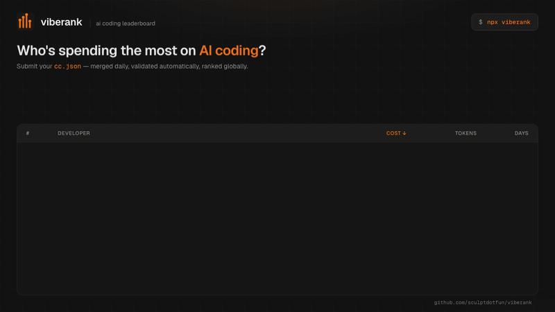

# viberank

A community-driven leaderboard for AI coding usage — [Claude Code](https://claude.com/claude-code), [Codex](https://ccusage.com/guide/codex/), Gemini CLI and every other tool [`ccusage`](https://github.com/ryoppippi/ccusage) tracks. Submit your stats and see how you rank.




Live at **[viberank.app](https://www.viberank.app)**.

> **v2 — multi-tool support.** viberank started as a Claude Code leaderboard. As `ccusage` grew to track Codex, Gemini CLI, Copilot, OpenCode and more, viberank evolved with it: submissions from any supported tool are now accepted, recorded per tool, and filterable on the leaderboard. Claude Code remains a first-class citizen — you can now just see how it stacks up against the rest of your stack. Full details in the [CHANGELOG](./CHANGELOG.md).

## Features

- 🏆 **Global leaderboard** — top-3 podium + full table, sorted by cost or tokens, with 7d / 30d / custom date filters
- 🧰 **Multi-tool** — usage from Claude Code, Codex, Gemini CLI, Copilot, OpenCode and other `ccusage`-supported agents; every row shows **tool chips** and the board filters per tool
- 🎯 **Per-tool boards** — dedicated leaderboards at [`/tool/claude`](https://www.viberank.app/tool/claude), [`/tool/codex`](https://www.viberank.app/tool/codex), [`/tool/gemini`](https://www.viberank.app/tool/gemini), [`/tool/copilot`](https://www.viberank.app/tool/copilot), [`/tool/opencode`](https://www.viberank.app/tool/opencode)
- 📊 **Profile pages** at `viberank.app/profile/{username}` — global rank, daily charts, token breakdown, tools used
- ⚡ **Server-rendered** — homepage, profiles, and tool boards are SSR'd with structured data (FAQPage, ProfilePage, BreadcrumbList) for fast paint and full crawlability
- 🚀 **Four ways to submit**: `npx viberank-cli`, plain `curl`, signed-in web upload, or MCP
- ♾️ **Autosubmit** — `viberank login` once, `viberank autosubmit` once, and your rank stays current instead of freezing on the day you first submitted
- 🔐 **GitHub OAuth + API tokens** — OAuth and token submissions show a blue check; header-only CLI submissions show a `cli` pill
- 🖥️ **Multi-machine** — a laptop and a desktop sum into one profile instead of overwriting each other
- 📈 **[`/stats`](https://www.viberank.app/stats)** — site-wide spend curve, monthly trend, and where your burn lands against everyone else
- 🧮 **[`/calculator`](https://www.viberank.app/calculator)** — which subscription tier your actual usage justifies, based on your real `ccusage` numbers rather than a guess
- ⚔️ **[Head-to-head comparisons](https://www.viberank.app/compare)** — `/compare/claude-vs-codex` and every other tool matchup, with live adoption numbers from the board
- 🎖️ **README badges** — `https://www.viberank.app/api/badge/{username}` for rank, cost, or tokens
- 🛡️ **Input validation** — one-sided token math (reasoning-token aware), cost/token ratio guard, date sanity, realistic-range ceilings
- 🔄 **Merge flow** — re-submitting the same range overwrites prior daily entries; merging combines unverified CLI rows into your verified profile
- ✍️ **Blog** — data-backed posts on AI coding costs at [viberank.app/blog](https://www.viberank.app/blog) ([RSS](https://www.viberank.app/feed.xml)); [`llms.txt`](https://www.viberank.app/llms.txt) for AI search engines

## Submitting your usage data

### Option 1: `npx viberank-cli` (recommended)

```bash
npx viberank-cli
```

This generates a fresh `cc.json` via `ccusage daily --json` (the aggregate report across **all** your detected tools) and POSTs it to `/api/submit`. It picks up your GitHub username from your git remote / `git config user.name`.

**Set it and forget it.** A one-off submission freezes your rank on the day you ran it. Mint a token at [viberank.app/settings/tokens](https://www.viberank.app/settings/tokens), then:

```bash
npx viberank-cli login       # paste the token once
npx viberank-cli autosubmit  # daily background submission
```

`autosubmit` registers with your platform's own scheduler — launchd, systemd user timers, or Task Scheduler — rather than running a daemon of its own, so it survives reboots and catches up after a missed run. `npx viberank-cli status` shows the token and schedule state; `autosubmit off` removes it. Token submissions are verified, so they carry a blue check without a browser sign-in.

### Option 2: curl

```bash
npx ccusage@latest daily --json > cc.json
curl -X POST https://www.viberank.app/api/submit \
  -H "Content-Type: application/json" \
  -H "X-GitHub-User: $(git config user.name)" \
  -d @cc.json
```

> `ccusage` v20 keys daily entries by `period` and reports an `agent` per day; viberank normalizes this server-side, so either the new or older `ccusage` output works.

### Option 3: Web upload

1. Sign in to [viberank.app](https://www.viberank.app) with GitHub
2. Click **Submit Stats** → **Upload cc.json**
3. Drop your `cc.json` file

Web uploads come back with a verified badge automatically. CLI submissions show as unverified until you sign in and merge them via the prompt on the homepage.

### Option 4: MCP server

If you use an MCP-compatible client, [`viberank-mcp`](https://www.npmjs.com/package/viberank-mcp) ([source](./packages/viberank-mcp-server)) exposes submit and lookup tools:

```bash
npx viberank-mcp
```

## Data validation

Submissions are checked at the API level. Anything that fails these rules is rejected:

- **Token math** — `total >= input + output + cache_creation + cache_read`. The total may legitimately *exceed* the four components because reasoning/thinking tokens (Gemini, Codex, Claude extended thinking) are counted in `totalTokens` but not broken out by `ccusage`. We only reject a total that is *less* than its known parts.
- **Cost/token ratio** — must fall within a realistic band; this is the primary guard against inflated token counts now that the token-sum check is one-sided
- **No negative values** anywhere in totals or daily breakdowns
- **Valid date format** — `YYYY-MM-DD`
- **Not too far in the future** — dates after tomorrow-UTC are rejected (covers users at any global timezone offset)
- **Realistic ranges** — total cost can't exceed `$5,000 × 365 days`

Submissions can also be flagged for review by an admin via `/admin`; flagged rows are hidden from the leaderboard by default.

See [VALIDATION.md](./VALIDATION.md) for the full ruleset.

## Merging multiple submissions

If you submit via the CLI before signing in, the row lands on the leaderboard as **unverified** (`cli` pill). Once you sign in with the matching GitHub account, the homepage shows a banner offering to verify or merge. That hits an authenticated `/api/claim` endpoint which:

1. Finds all submissions under your GitHub username
2. Picks a base submission (OAuth-verified row wins; else most recent)
3. Merges daily breakdowns — overlapping dates take the OAuth version
4. Recomputes totals, sets `verified: true`, deletes the duplicates

## Submitting from more than one machine

Supported — a laptop and a desktop sum into one profile rather than overwriting each other ([#43](https://github.com/sculptdotfun/viberank/issues/43)).

Each machine generates an anonymous random UUID on first run, stored at `~/.viberank/machine-id`. The server keeps usage as a **per-machine slice** and re-sums them, so re-submitting from one machine replaces only that machine's contribution and leaves the others intact. No hardware or identifying information is involved.

Two consequences worth knowing:

- **A machine's totals never silently decrease.** If a re-submission reports *less* than that machine previously contributed — a pruned `~/.claude/projects`, a fresh install, a partial export — the higher prior figure is retained instead. Deleting local transcripts doesn't erase your rank.
- **Genuine deletion is still recorded.** The CLI reports per-month file and byte counts of your transcript corpus, and the server classifies a shrink as *deleted* vs *rewritten* rather than guessing ([#112](https://github.com/sculptdotfun/viberank/issues/112)). Counts only — no transcript content ever leaves your machine.

## Development

### Prerequisites

- Node.js 18+ and pnpm 10+
- A [Supabase](https://supabase.com) project (free tier is fine)
- A GitHub OAuth app

### Setup

```bash
git clone https://github.com/sculptdotfun/viberank.git
cd viberank
pnpm install
cp .env.example .env.local
```

Fill in `.env.local` (see `.env.example` for the full list). The required keys are:

```env
NEXT_PUBLIC_SUPABASE_URL=https://<project-ref>.supabase.co
NEXT_PUBLIC_SUPABASE_ANON_KEY=<anon-key>
SUPABASE_SERVICE_ROLE_KEY=<service-role-key>

NEXTAUTH_URL=http://localhost:3000
NEXTAUTH_SECRET=<openssl rand -base64 32>

GITHUB_ID=<github-oauth-client-id>
GITHUB_SECRET=<github-oauth-client-secret>
```

Apply the schema:

```bash
# Run the SQL in supabase/migrations/ in order against your project,
# either via the Supabase SQL editor or the supabase CLI:
#   001_initial_schema.sql
#   002_multi_tool.sql          # submissions.tools[] + daily_breakdowns.agents[]
#   003_open_to_work.sql        # hire-me flags on profiles
#   004_model_breakdowns.sql    # per-model token/cost split
#   005_machine_contributions.sql  # per-machine slices (#43)
#   006_raw_submissions.sql     # raw payload archive
#   007_site_stats.sql          # cached site-wide aggregates
#   008_site_stats_monthly_tiers.sql
#   009_open_to_work_email.sql
#   010_api_tokens.sql          # hashed CLI tokens
#   011_efficiency.sql          # cost-per-token, generated column
#   012_corpus_observations.sql # per-month corpus counts for drift (#112)
#   013_month_stats.sql         # per-month aggregates for /stats/monthly
#   014_reload_schema_cache.sql # refresh PostgREST's cached schema
```

> **Applying migrations to an existing instance:** apply the SQL **before** deploying the app code. Every migration is additive — new columns default to empty and new tables are created `IF NOT EXISTS` — so each is safe to run ahead of its deploy.
>
> Run `014_reload_schema_cache.sql` last, and again after any future migration that adds a column. PostgREST serves a cached copy of the schema, so a newly added column is invisible to the API until that cache is reloaded — writes to it fail with `PGRST204: Could not find the '<column>' column of '<table>' in the schema cache` even though the column exists.

Run the dev server:

```bash
pnpm dev
```

Open <http://localhost:3000>.

For local visual QA without a Supabase project, enable the built-in demo data:

```bash
NEXT_PUBLIC_VIBERANK_DEMO_DATA=1 pnpm dev
```

Demo data is read-only and only intended to render realistic leaderboard, profile, model-list, and hire-page states during UI review.

### Useful scripts

| Command | What it does |
|---|---|
| `pnpm dev` | Start Next dev server (Turbopack) on port 3000 |
| `pnpm build` | Production build |
| `pnpm start` | Serve the production build |
| `pnpm lint` | Run `next lint` |
| `pnpm test` | Run every `test/*.test.mts` suite — ccusage parsing, data layer, submissions, tokens, badges, corpus scanning, drift classification, plan comparison. Exits on the first failure. `node --import tsx test/ccusage.test.mts <path-to-cc.json>` additionally tests against real data |
| `pnpm exec tsc --noEmit` | Type-check without emitting |

## Tech stack

- **Frontend**: Next.js 16, React 19, TypeScript 5, Tailwind CSS 4
- **Backend**: Next.js API routes + Supabase (Postgres)
- **Auth**: NextAuth.js v4 with GitHub OAuth
- **Charts**: Recharts
- **Animation**: Framer Motion
- **Hosting**: Vercel

## API

### `POST /api/submit`

Submit usage data. Authenticated submissions (with a NextAuth session cookie) are marked `verified: true`; otherwise the request must include an `X-GitHub-User` header.

**Body**: contents of `cc.json` (output of `npx ccusage@latest daily --json`).

**Auth**, in precedence order:

| | Verified | Notes |
|---|---|---|
| `Authorization: Bearer vbr_…` | ✅ | API token; works headlessly, which is what `autosubmit` uses |
| NextAuth session cookie | ✅ | Web upload |
| `X-GitHub-User: <name>` | ❌ | Unauthenticated; anyone can set it, so the row shows a `cli` pill |

**Response**:

```json
{
  "success": true,
  "submissionId": "...",
  "message": "Successfully submitted data for username",
  "profileUrl": "https://viberank.app/profile/username"
}
```

### `POST /api/claim`

Authenticated — merges unverified CLI submissions into the caller's verified profile. Username is taken from the session, not the request body. Returns 401 without a session.

### `GET|POST /api/tokens`, `DELETE /api/tokens/{id}`

Authenticated (session only — a token cannot mint another token). Lists, creates and revokes API tokens for the signed-in user. Only the SHA-256 of a token is stored; the plaintext is shown once at creation and is unrecoverable afterwards. Revocation is soft, so `last_used_at` stays auditable after a suspected leak. UI at [`/settings/tokens`](https://www.viberank.app/settings/tokens).

### `GET /api/badge/{username}`

Public, unauthenticated. Returns a shields-style SVG for a README:

```markdown


```

`metric` is `rank` (default), `cost`, or `tokens`. Hand-built SVG rather than a rasterised image so it stays a few hundred bytes and sits crisply next to shields.io badges; cached at the edge with `stale-while-revalidate`.

### `POST /api/admin/flag`

Admin-only (allowlist in `src/lib/admin.ts`) — flags or unflags a submission for review. Runs server-side with the service-role client; returns 403 for non-admins.

### `GET /api/health`

Returns backend status:

```json
{ "api": "ok", "backend": "supabase", "backendConnection": "ok", "timestamp": "..." }
```

## Deployment

Designed to run on Vercel. Push to `main` to trigger an auto-deploy. The required production env vars are the same as `.env.example`; make sure `SUPABASE_SERVICE_ROLE_KEY` and the `NEXT_PUBLIC_*` Supabase vars are also listed in `turbo.json`'s `build.env` allowlist so Turbo passes them through.

[](https://vercel.com/new/clone?repository-url=https://github.com/sculptdotfun/viberank)

## Contributing

See [CONTRIBUTING.md](./CONTRIBUTING.md).

## License

[MIT](./LICENSE).

## Acknowledgments

- [Claude Code](https://claude.com/claude-code) by Anthropic
- [ccusage](https://github.com/ryoppippi/ccusage) — the usage tracker that produces `cc.json`

## Links

- [Website](https://www.viberank.app)
- [GitHub](https://github.com/sculptdotfun/viberank)
- [Report issues](https://github.com/sculptdotfun/viberank/issues)
- [`viberank-cli` on npm](https://www.npmjs.com/package/viberank-cli)
- [`viberank-mcp` on npm](https://www.npmjs.com/package/viberank-mcp)
